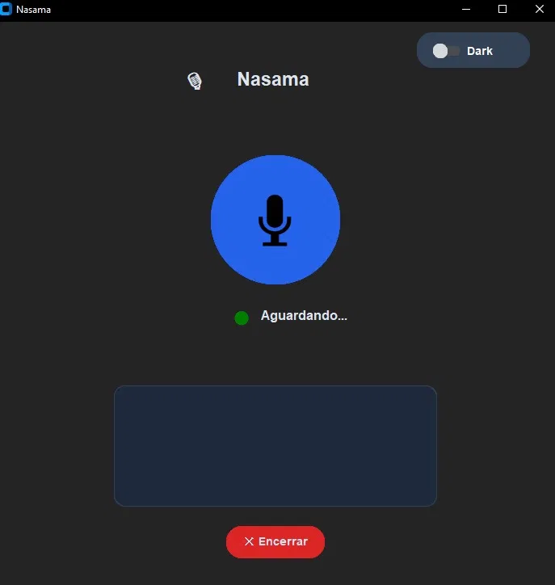
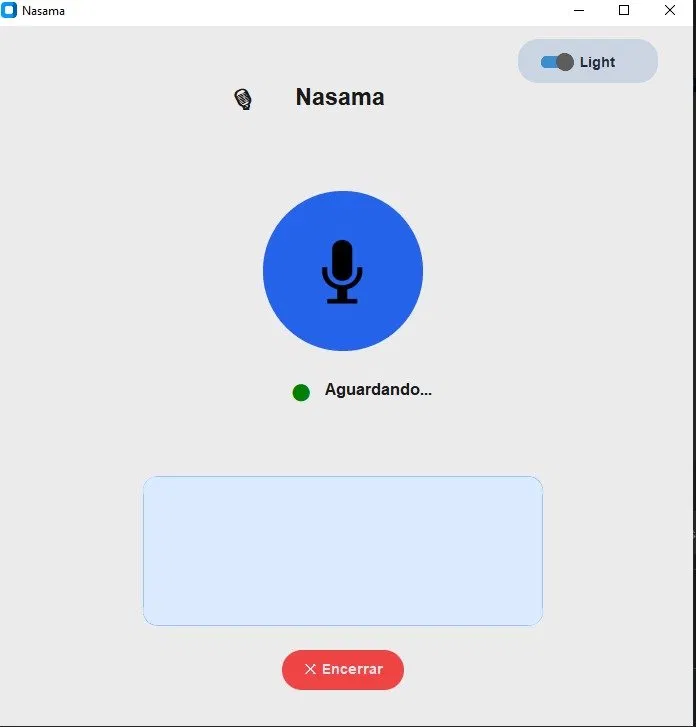

# 🎙️ Nasama 2.0 — Assistente Virtual com IA Conversacional

Assistente virtual desktop desenvolvida em Python com reconhecimento de voz, síntese de fala natural e inteligência artificial generativa integrada para conversas livres e automação de tarefas por comandos de voz.

> O nome **Nasama** é uma homenagem aos meus 3 pets: **Na**ni, **Sa**ndy e **Ma**ya. 🐾

> Projeto desenvolvido durante o curso **OneBitCode Python**, com integração de IA generativa via Groq API e síntese de voz natural com Edge TTS.


---

## 🆕 Mudanças da v1.0 para v2.0

| Recurso | v1.0 | v2.0 |
|---|---|---|
| **Voz** | gTTS (robótica) | ✅ Edge TTS (natural) |
| **Inteligência** | Comandos fixos | ✅ IA Conversacional |
| **Memória** | ❌ | ✅ Lembra seu nome |
| **Personalidade** | Genérica | ✅ Própria personalidade |
| **Comandos** | Palavra exata | ✅ Linguagem natural livre |
| **Status visual** | ❌ | ✅ Ouvindo / Falando |

---

## 📸 Interface

| Dark Mode | Light Mode |
|---|---|
|  |  |

---

## 🚀 Funcionalidades

- 🤖 **IA Conversacional** — responde qualquer pergunta com Groq AI
- 🎙️ **Voz Natural** — síntese de voz com Edge TTS (pt-BR-FranciscaNeural)
- 📝 **Memória** — lembra seu nome entre conversas
- ⏰ **Hora atual** — "que horas são?", "me diga a hora", "horário"
- 📧 **Email por voz** — "enviar email", "mandar mensagem"
- 💵 **Cotações em tempo real** — dólar, euro, bitcoin
- 📰 **Notícias** — busca em 5 fontes (Google, Globo, UOL, BBC, Folha)
- 🌡️ **Clima** — temperatura de qualquer cidade
- 💻 **Sistema** — desligar computador, cancelar desligamento
- 🌓 **Interface** — dark mode / light mode
- 💬 **Histórico** — conversa salva na tela
- 🔵 **Status visual** — indicador de ouvindo / falando

---

## 🏗️ Arquitetura

```text
Usuário
   ↓
Microfone
   ↓
SpeechRecognition
   ↓
Processamento de Comandos
   ├── Comando reconhecido → executa função
   │      ├── Email
   │      ├── Notícias
   │      ├── Clima
   │      ├── Cotação
   │      └── Sistema Operacional
   └── Comando livre → Groq AI responde
   ↓
Edge TTS
   ↓
Resposta por Voz
```

---

## 🛠️ Tecnologias utilizadas

| Tecnologia | Finalidade |
|---|---|
| `Edge TTS` | Síntese de voz natural (pt-BR) |
| `SpeechRecognition` | Reconhecimento de voz |
| `Google Speech API` | Transcrição de áudio em português |
| `Groq API` | IA generativa (llama-3.1-8b-instant) |
| `smtplib / ssl` | Envio de e-mails |
| `customtkinter` | Interface gráfica moderna |
| `pygame` | Reprodução de áudio |
| `Pillow` | Manipulação de imagens |
| `requests` | Consumo de APIs externas |
| `BeautifulSoup4` | Leitura de feeds RSS |
| `python-dotenv` | Gerenciamento de variáveis de ambiente |
| `OpenWeatherMap API` | Temperatura e clima por cidade |

---

## 📁 Estrutura do Projeto

```
nasama-2.0/
│
├── .env.example          # exemplo de configuração
├── .gitignore
│
├── files/
│   ├── senha             # não incluso — senha de app do Gmail
│   ├── contatos.json     # não incluso — agenda de contatos
│   └── memoria.json      # não incluso — memória do usuário
│
├── images/
│   └── image.png         # ícone da interface
│
├── screenshots/
│   ├── dark.png          # interface tema dark
│   └── light.png         # interface tema light
│
├── funcoes_clima.py      # temperatura por cidade
├── funcoes_cotacao.py    # cotação de moedas
├── funcoes_email.py      # envio de e-mail por voz
├── funcoes_groq.py       # integração com Groq AI
├── funcoes_noticias.py   # notícias de 5 fontes RSS
├── funcoes_so.py         # funções do sistema operacional
├── interface.py          # interface gráfica
├── nasama.py             # arquivo principal
├── requirements.txt
└── README.md
```

---

## ⚙️ Configuração

### 1. Clone o repositório
```bash
git clone https://github.com/ThiagoRamos16/Nasama-2.0.git
cd Nasama-2.0
```

### 2. Instale as dependências
```bash
py -3.12 -m pip install -r requirements.txt
```
> Bibliotecas instaladas: `edge-tts`, `SpeechRecognition`, `groq`, `customtkinter`, `Pillow`, `pygame`, `requests`, `beautifulsoup4`, `python-dotenv`

### 3. Configure as variáveis de ambiente

Crie um arquivo `.env` na raiz do projeto utilizando o `.env.example` como modelo:

```env
GROQ_API_KEY=sua_chave_aqui
OPENWEATHER_API_KEY=sua_chave_aqui
```

Obtenha as chaves gratuitamente:
- Groq: https://console.groq.com
- OpenWeather: https://openweathermap.org

### 4. Senha do Gmail

Crie o arquivo `files/senha` com sua senha de aplicativo do Gmail.

Para gerar uma senha de aplicativo:
1. Ative a verificação em duas etapas na sua conta Google
2. Acesse: https://myaccount.google.com/apppasswords
3. Gere uma nova senha de aplicativo
4. Copie e salve no arquivo `files/senha`

### 5. Agenda de contatos

Crie o arquivo `files/contatos.json`:
```json
{
    "exemplo": "exemplo@gmail.com",
    "exemplo2": "exemplo2@gmail.com"
}
```

### 6. Execute

> ⚠️ **Recomendado: Python 3.12** — versões mais recentes podem apresentar incompatibilidades com algumas dependências.

```bash
# Windows com múltiplas versões Python
py -3.12 nasama.py

# Outros sistemas
python nasama.py
```

---

## 🗣️ Exemplos de comandos

| Comando | Ação |
|---|---|
| *"que horas são?"* | Informa a hora atual |
| *"enviar email"* | Inicia o fluxo de envio de e-mail por voz |
| *"notícias"* | Pergunta a fonte e lê as 3 últimas notícias |
| *"quanto está o dólar?"* | Informa a cotação do Dólar |
| *"cotação do euro"* | Informa a cotação do Euro |
| *"bitcoin"* | Informa a cotação do Bitcoin |
| *"temperatura em SP"* | Informa o clima atual |
| *"desligar em uma hora"* | Agenda desligamento em 1 hora |
| *"cancelar desligamento"* | Cancela o desligamento agendado |
| *"fechar assistente"* | Encerra a Nasama |
| *Qualquer pergunta livre* | Groq AI responde! |

---

## ⚠️ Segurança

Os arquivos abaixo não são enviados para o repositório:

```
files/senha
files/contatos.json
files/memoria.json
.env
```

Utilize sempre uma senha de aplicativo do Gmail e nunca sua senha principal.

---

## 🔮 Próximas versões

- [ ] Integração com N8N (Nasama 3.0)
- [ ] Controle do computador via IA (PyAutoGUI)
- [ ] Avatar animado (estilo Alexa)
- [ ] Integração com Google Calendar
- [ ] Multi-idioma

---

## 👨‍💻 Autor

**Thiago Ramos da Silva**
[linkedin.com/in/thiagoramosdasilva](https://www.linkedin.com/in/thiagoramosdasilva)

---

**Versão anterior:** [Nasama 1.0](https://github.com/ThiagoRamos16/Nasama-1.0)
